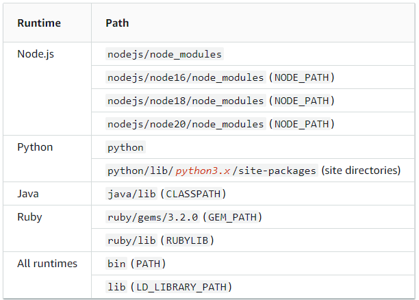

# Serverless Cloud Drive

A fully serverless cloud drive application built with modern web technologies, providing secure and scalable storage, user authentication, and seamless file management.

## Tech Stack

### AWS Serverless services

- AWS AppSync
- Amazon DynamoDB
- AWS Lambda
- Amazon Cognito
- Amazon S3
- AWS Amplify Gen2
- AWS CDK

### UI

- Next.js (React)
- TypeScript
- Shadcn UI

## Deployment steps

Follow below steps to deploy the application on AWS account.

### 1. Deploy application (frontend + backend)

1. TODO
2. TODO

## Architecture

## Design

## Lamdba layers used in the project

The following third-party libraries have been used as Lambda layer:

- **Sharp**: High performance Node.js image processing library
- **FFmpeg**: Cross-platform solution to record, convert and stream audio and video

### How Lambda layer works?

When you add a layer to a function, Lambda loads the layer content into the `/opt` directory of that execution environment. For each Lambda runtime, the `PATH` variable already includes specific folder paths within the `/opt` directory. To ensure that the PATH variable picks up your layer content, your layer .zip file should have its dependencies in the following folder paths:

To learn more, refer to [Layer paths for each Lambda runtime](https://docs.aws.amazon.com/lambda/latest/dg/packaging-layers.html#packaging-layers-paths)

## Considerations for Upgrades and Maintainence (Runbook)

### 1. How to update Sharp lambda layer?

1. CDK is already configured to pick the Sharp layer from `amplify\layers\sharp-layer.zip`.
2. Go to `amplify\layers`, and deleet `sharp-layer.zip` file.
3. Now run `npx ampx sandbox`, this time `sharp-layer.zip` file is not found, so CDK uses docker bundling to create layer artifacts.
4. After successful deployment, go to AWS console, download the layer content.
5. Rename the downloaded file with `sharp-layer.zip`, and copy it at ``amplify\layers` path.
6. That's all!

### 2. How to update FFmpeg lambda layer?

1. Go to `https://johnvansickle.com/ffmpeg/` website which hosts static builds of FFmpeg.
2. Download `ffmpeg-release-amd64-static.tar.xz` file, and extract its content.
3. Create new folder `ffmpeg/bin`.
4. From the extracted content, select `ffmpeg` and `ffprobe` files, copy both files inside `ffmpeg/bin`.
5. Now, create a zip of `ffmpeg/bin/*` with file name `ffmpeg-layer.zip`.
6. Copy this `ffmpeg-layer.zip` file at `amplify\layers` location.
7. CDK is already configured to pick the FFmpeg layer from `amplify\layers\ffmpeg-layer.zip`.
8. That's all!

### 3. How to update Lambda functions when new Node.js runtime releases?
